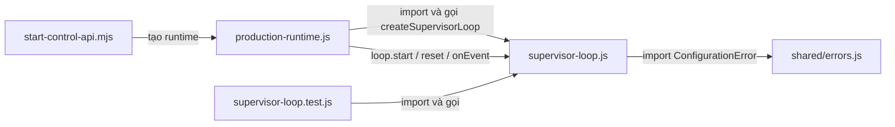

<!-- Tóm tắt: Đối chiếu Code Index với mã nguồn để thấy đầy đủ symbol và nơi sử dụng Supervisor loop. -->
# Code graph: `supervisor-loop.js`

## Ảnh chụp Code Index

- File: [`backend/src/modules/supervisor/supervisor-loop.js`](../../backend/src/modules/supervisor/supervisor-loop.js)
- Truy vấn: `search({ query: "supervisor-loop", kind: "file", projection: "graph", limit: 20 })`; chọn kết quả có đường dẫn đúng như trên.
- Phiên bản index: `IDX-38289`; file ID: `FILE-5791e669-f7cf-4b46-967a-bb6714e258f6`.
- Ngôn ngữ: JavaScript; kích thước: 6.653 byte; SHA-256: `7ec18864c45bf65f975180f5c14900db8db07f3a6a81f857201c74ab1bbfb008`.
- SHA-256 trong index khớp file hiện tại khi kiểm tra. Khoảng dòng dưới đây thuộc phiên bản file này; cần kiểm tra lại sau khi sửa file.

## Toàn bộ symbol của file

| Symbol | Loại | Dòng | Vai trò | Nơi gọi trực tiếp đã xác nhận |
| --- | --- | ---: | --- | --- |
| `createSupervisorLoop` | function, export | 4–82 | Tạo vòng điều phối và trả `{ start, reset, onEvent }`. | `createProductionSupervisorRuntime` trong `production-runtime.js:44`; test gọi tại `supervisor-loop.test.js:26`. |
| `reset` | function nội bộ, được trả ra | 8 | Cho phép vòng chạy khởi động lại bằng cách xóa cờ `started`. | `startTaskExclusive` gọi `loop.reset()` tại `production-runtime.js:76`. |
| `start` | function nội bộ, được trả ra | 9–18 | Nhận request, chọn agent, chuyển sang `RUNNING`, phát trạng thái rồi đưa việc vào sender queue. | `startTaskExclusive` tại `production-runtime.js:85`; `recover` tại dòng 138; test tại `supervisor-loop.test.js:37`. |
| `emitAgentWorking` | function nội bộ | 20–30 | Phát `agent.status_changed` với trạng thái `WORKING` qua execution event bus. | `start` tại `supervisor-loop.js:15`. |
| `selectAgent` | function nội bộ | 31–38 | Dùng agent có sẵn trong request hoặc chọn profile sẵn sàng theo role. | `start` tại `supervisor-loop.js:13`. |
| `onEvent` | function nội bộ, được trả ra | 39–70 | Xử lý phản hồi agent, changeset, kết quả verification và lỗi để chuyển trạng thái hoặc điều phối bước tiếp theo. | Subscriber trong `production-runtime.js:52`; test tại `supervisor-loop.test.js:45,54,63,72,80,87,94`. |
| `startRepairRound` | function nội bộ | 74–80 | Tạo lượt sửa lỗi, đưa request vào sender queue và chuyển lại `RUNNING`. | `onEvent` tại `supervisor-loop.js:60,67`. |
| `terminal` | function nội bộ | 81 | Phát event kết thúc task qua execution event bus. | `onEvent` tại `supervisor-loop.js:66,68`. |

## File liên quan và đường gọi

| File | Quan hệ đã xác nhận | Bằng chứng |
| --- | --- | --- |
| [`production-runtime.js`](../../backend/src/modules/supervisor/production-runtime.js) | Import `createSupervisorLoop`, tạo một loop cho mỗi Supervisor, lưu trong `loops`, rồi gọi `reset`, `start`, `onEvent`. | Import dòng 14; tạo dòng 44; `onEvent` dòng 52; `reset` dòng 76; `start` dòng 85 và 138. |
| [`supervisor-loop.test.js`](../../backend/tests/unit/supervisor-loop.test.js) | Import và tạo loop trong test; gọi `start` và `onEvent`. | Import dòng 3; tạo dòng 26; các lời gọi trong bảng symbol. |
| [`start-control-api.mjs`](../../backend/scripts/start-control-api.mjs) | Khởi tạo `createProductionSupervisorRuntime`, nên sử dụng loop **gián tiếp** qua runtime; không import `supervisor-loop.js` trực tiếp. | Dòng 60. |
| [`errors.js`](../../backend/src/shared/errors.js) | Được `supervisor-loop.js` import để tạo `ConfigurationError`; đây là phụ thuộc đi ra, không phải file gọi loop. | Import tại `supervisor-loop.js:2`. |

Trong nội bộ file, `start → selectAgent → emitAgentWorking`; `onEvent → startRepairRound` khi cần sửa lỗi và `onEvent → terminal` khi kết thúc thành công hoặc thất bại.

## Giới hạn của graph hiện tại

Code Index lưu hai cạnh `imported_by` từ `production-runtime.js` và `supervisor-loop.test.js`, một cạnh import đến `shared/errors.js`, cùng cạnh gọi `createProductionSupervisorRuntime → createSupervisorLoop` ở dòng 44. Nó cũng lưu sáu cạnh gọi giữa các hàm nội bộ được nêu trong bảng.

Các lời gọi qua object trả về (`loop.start`, `loop.reset`, `loop.onEvent`) **không xuất hiện trong bảng `calls` của Code Index**. Chúng được xác nhận bằng tìm kiếm và đọc mã nguồn. Vì vậy riêng `projection: "graph"` hiện chưa trả đầy đủ danh sách file gọi từng phương thức của loop.
